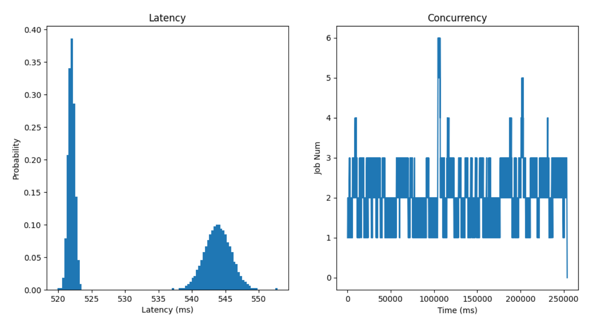
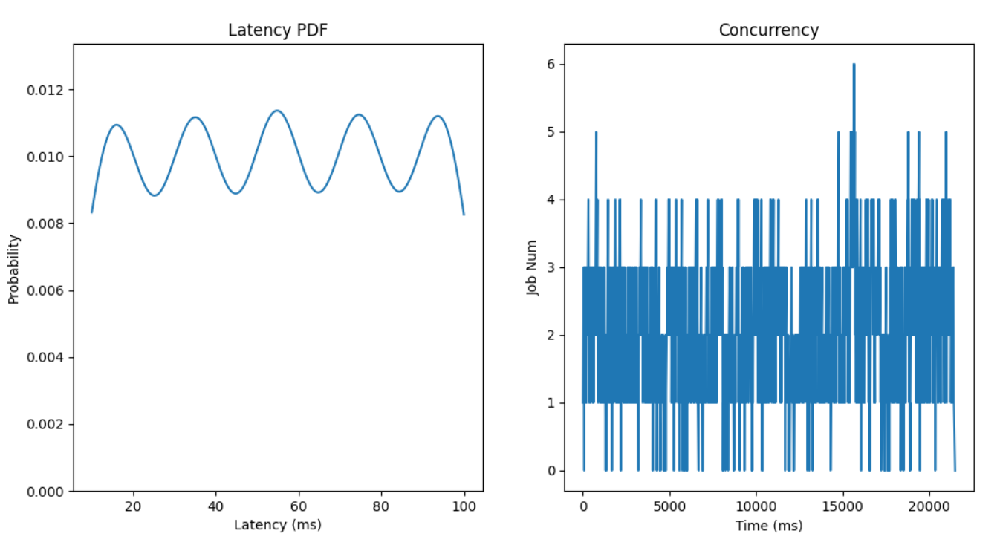

# DynWork

This repo generates dynamic workloads. There are two main parts:

- Multimodal workloads from real NLP datasets
- Multimodal synthesized workloads

## Prerequisite

This repo requires `Python 3.8`

The package requirements are stated in `requirments.txt`

## Trace

There are two traces provided: WordCup and Azure.

- Worldcup
  - Source: https://github.com/chengtx/WorldCup98
  - We pre-processed the data and stored its rate (incoming request per second) from `1998-06-25 22:00:01 `  to `1998-06-27 22:00:00 ` in `trace_data/worldcup/rate.csv`
- Azure
  - Source: https://azurecloudpublicdataset2.blob.core.windows.net/azurepublicdatasetv2/azurefunctions_dataset2019/azurefunctions-dataset2019.tar.xz

> The configs for truncating the trace are specified in `generate_utils.py` and they can be changed as commented.

## Multimodal_Real_Dataset

This part contains 8 workloads with two modalities generated from real NLP datasets.

### Workload Setting

| Task          | Model      | Dataset |
| ------------- | ---------- | ------- |
| Chatbot       | GPT        | Cornell |
| Chatbot       | GPT        | ConvAI |
| Chatbot       | Blenderbot | Cornell  |
| Chatbot       | Blenderbot | ConvAI  |
| Summarization | T5         | CNN     |
| Summarization | Bart       | CNN     |
| Translation   | FSMT       | WMT     |
| Translation   | MBart      | WMT     |

**For detailed informtion of the models and datasets, please refer to `workload.md`**

### Usage

1. **Generate sample data under `workload` directory.**  

```
cd workload
python main.py --dir ./log --num 3000 --task chatbot --device cuda:0 --max_batch 128
```

​       Three files will be generated for each workload:

- `{task}_{model}_{dataset}.csv`: It records the input length, the output length and the inference latency for each sentence job.
- `{task}_{model}_{dataset}_batch.csv`: It records the inference latency for one sentence job as the batch size increases. To get steady results, we warm 10 times and repeat 10 times to get the mean for each batch size.
- `{task}_{model}_{dataset}.png`: It plots *InputLen vs InferenceLatency*, *OutputLen vs InferenceLatency*, *InputLen vs OutputLen*, *BatchSize vs InferenceLatency* for each workload.

2. **Generate workloads with two modalities using sample data.** The workloads follow the mixture distribution and the two modalities are the `P5` and `P95` of the inference latency of the sample data. The `Admitted` time are generated following a specific trace and its rate can be scaled by adjusting the `rate_downgrade` argument.

```
cd ../
python generate_multimodal_rea_dataset.py --dir ./log/multimodal_real_dataset --sample_dir ./workload/log --trace azure --task chatbot --batch 8 --rate_downgrade 0.25 --num 1000 --trace_num 100
```

​		Four files will be generated for each workload:

- `jobs.bucketed.csv`: It records *JobId, InputLen, Length, Admitted, BucketIdx* of the jobs, where *Length* is the inference latency and *BucktIdx* is the modality it belongs to.
- `latencies.csv`: It is the copy of the original `{task}_{model}_{dataset}_batch.csv`
- `buckets.csv`: It divides each bucket into 10 bins and records the start value, the end value and the count of each bin. *BucketStart* and *BucketEnd* are set to 0.
- `jobs.png`: It plots the histogram of the inference latency of the workload and the concurrency as follows.



## Multimodal_Synthesized

This part contains 13 synthesized workloads following mixture distribution with various $\mu$ and $\sigma$.

### Workload Setting

| Task          | Modality_num | $\mu$                                    | $\sigma$                 | job_num |
| ------------- | ------------ | ---------------------------------------- | ------------------------ | ------- |
| Modal_num     | 1            | [0]                                      | [1]                      | 200     |
| Modal_num     | 2            | [-3, 3]                                  | [1, 1]                   | 200     |
| Modal_num     | 3            | [-6, 0, 6]                               | [1, 1, 1]                | 200     |
| Modal_num     | 4            | [-20, -10, 0, 10]                        | [1, 1, 1, 1]             | 800     |
| Modal_num     | 5            | [-45, -30, -15, 0, 15]                   | [1, 1, 1, 1, 1]          | 800     |
| Modal_num     | 6            | [-60, -40, -20, 0, 20, 40]               | [1, 1, 1, 1, 1, 1]       | 800     |
| Modal_num     | 7            | [-200, -150, -100, -50, 0, 50, 100]      | [1, 1, 1, 1, 1, 1, 1]    | 2500    |
| Modal_num     | 8            | [-240, -180, -120, -60, 0, 60, 120, 180] | [1, 1, 1, 1, 1, 1, 1, 1] | 2500    |
| Equal_Std     | 2            | [-3, 3]                                  | [0.5, 0.5]               | 200     |
| Equal_Std     | 2            | [-3, 3]                                  | [1, 1]                   | 200     |
| Equal_Std     | 2            | [-3, 3]                                  | [2, 2]                   | 200     |
| Not_Equal_Std | 2            | [-3, 3]                                  | [0.5, 2]                 | 200     |
| Not_Equal_Std | 2            | [-3, 3]                                  | [2, 0.5]                 | 200     |

### Usage

We normalize the inference latency of all workloads to `[10, 100] ms` and it can be changed in `generate_multimodal_synthesized.py`.

```
python generate_multimodal_synthesized.py --dir ./log/multimodal_synthesized --inputlen_path ./synthesized_sample/inputlen_sample.csv --latencies_path ./synthesized_sample/latencies_sample.csv --trace azure --batch 8 --rate_downgrade 0.25 --trace_num 50
```

The same four files will be generated as in **Multimodal_Real_Dataset** execpt that in `jobs.png`, it plots the PDF of the inference latency of the workload as follows.

